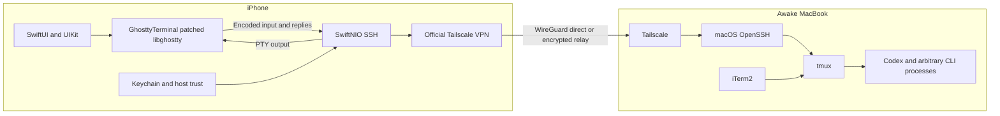

# Architecture decision

Date: 2026-09-06. Status: recommended for a bounded spike; physical-device acceptance pending. Research: [terminal](research/libghostty.md), [transport](research/transport.md), [SSH](research/ssh.md), [lifecycle](research/ios-lifecycle.md), [licenses](research/licenses.md), [alternatives](research/ecosystem.md).

## One recommended architecture

SwiftUI app shell + community GhosttyTerminal UIKit/Metal frontend + Apple SwiftNIO SSH, connecting through the official Tailscale OS VPN to ordinary macOS OpenSSH and an existing tmux session. iTerm2 attaches independently. No companion or MoshDeck service.



Tailscale still uses its coordination service and may use a DERP relay. The diagram shows the logical encrypted connection, not a guarantee of a physically direct route. No terminal content enters a MoshDeck backend because none exists.

## Decision table

| Question | Decision | Confidence |
| --- | --- | --- |
| Terminal engine | Pinned Lakr233 GhosttyTerminal for spike; daily-use adoption gated on device results | Medium |
| Initial transport | Apple SwiftNIO SSH 0.15.0 to macOS OpenSSH with PTY | Medium |
| Tailscale | Official apps, ordinary OS networking and manually configured MagicDNS hostname | High |
| Mosh | Not initial scope; compare an existing client only if SSH mobility/latency disappoints | Medium |
| tmux | Required for continuity; Level 1 saved attach helper | High |
| iTerm2 integration | Independent ordinary tmux attachment; no direct API | High |
| Mac companion | None | High |
| Backend | None owned by MoshDeck | High |
| Codex integration | Raw terminal only; no required SDK/events/log parsing | High |
| Notifications | Deferred; later minimal APNs events only if valuable | High |
| Product name | Working name only; transport-neutral public name before release | Medium |

Confidence describes architectural fit, not full acceptance. A physical iPhone has completed SSH authentication, PTY startup and first shell output; synthetic terminal and keyboard tests also pass. The owner subsequently confirmed live command use. Phone tmux attachment and a concurrent local Mac PTY client retain the original shell. Automatic recovery after a measured 116-second background interval and after app-grace expiry/authentication now passed. Exact iTerm2 UI handoff, longer screen locks, full network outage, broad terminal fidelity and battery remain unproved. See [device evidence](research/physical-device-connection-debug.md).

## Boundaries, not a framework

- UI owns hosts, connection status, lock, terminal presentation and composer draft.
- Ghostty adapter owns view/configuration, parser lifetime, paste/key operations and clipboard policy. Only this boundary imports Ghostty.
- SSH transport owns socket/authentication, PTY requests, ordered bytes, resize, backpressure, cancellation and liveness. Only this boundary imports NIOSSH.
- Session coordinator maps one host and tmux target to a connection generation and renderer. No abstract agent/session hierarchy.
- Authentication owns the per-phone identity in Keychain and hostname/port-to-host-key trust. Host verification happens before user authentication.

A small byte/resize callback boundary is sufficient. Do not create unused `MoshTransport`, generic registries, repositories for every data object, or agent protocols. A future Mosh adapter needs explicit state synchronization/terminal encoding integration, not merely conformance to a socket interface.

Use Swift concurrency for ownership/lifecycle and NIO's event-loop rules inside transport. UI on the main actor; no synchronous DNS/crypto/network waits there. Bounded receive and send queues are correctness requirements. Do not drop middle bytes to reduce memory: stop reading or disconnect with a clear error. Defer a custom Network.framework stack; `NWPathMonitor` may help classify path changes but is not an SSH liveness detector.

## tmux handoff model

The user must begin persistent work inside tmux. Both clients attach as the same Mac user to the same tmux server/socket. An old iTerm2 process outside tmux remains outside scope. No process injection/reparenting.

Initial explicit creation can run:

```bash
tmux new-session -A -s work
```

A reconnect must attach only, so a dead session is visible rather than silently replaced:

```bash
tmux attach-session -t '=work'
```

Do not use `-d` by default; that would detach the Mac client. Explicit disconnect closes the phone SSH channel. tmux's ordinary prefix + `d` is also available. Do not send Ctrl-D or kill commands to implement disconnect. Keep `destroy-unattached off`; never change a user's global tmux configuration without a demonstrated need.

A tmux pane has **one size** at a time. Simultaneous attachments cannot each give the same process a different independent layout. Recommend testing per-workspace `window-size latest`: the client most recently used supplies the size, and the Mac regains its layout when used again. Compare `smallest` if deterministic shared geometry is preferred. `largest` can leave the phone viewing a clipped viewport. `aggressive-resize` is about sessions where a window is current; it does not solve independent phone/Mac layouts. Do not enable it as a magic mobile fix.

A read-only/ignore-size attachment is useful later for passive viewing, not the default control session. Grouped sessions can offer separate window selection but still share windows/panes and do not remove sizing constraints. Control mode provides native projections at substantial complexity and is deferred. [tmux manual](https://github.com/tmux/tmux/blob/master/tmux.1), [advanced use](https://github.com/tmux/tmux/wiki/Advanced-Use).

Use plain tmux attachment inside iTerm2 first. Its optional `tmux -CC` mode has native window-close semantics that can kill windows; it also adds another size-management layer. The phone does not need to know about it. Test separately if the owner uses it. [iTerm2 integration](https://iterm2.com/documentation-tmux-integration.html).

## Level 1 helpers and metadata

Save a session target; display optional `tmux list-sessions` output through a separate bounded SSH exec channel. For future browsing use explicit format strings and stable IDs (`session_id`, `window_id`, `pane_id`), not parsing decorated interactive output. Exact-target matching avoids tmux prefix ambiguity. Validate a small saved-name alphabet or correctly shell-quote it; never interpolate terminal titles or untrusted metadata into shell syntax.

`list-windows`, `list-panes` and `display-message` provide path, command and IDs without a daemon. A query's `pwd` does not reveal another pane's working directory. Metadata is untrusted and may be stale or contain control characters. No automatic `ps` command-line harvesting. Native session/window/pane reconciliation and control mode are Level 2/3, not needed for MVP.

For history, the current phone renderer holds its own bounded scrollback; tmux copy mode accesses remote history, including output missed while disconnected. Reattach redraws the visible screen but does not restore the entire local scrollback. Set and test a reasonable remote history limit (for example 10,000 lines) on the test session rather than promising infinite history.

## Security boundaries

An authenticated terminal is authority over the Mac user's developer identity. Tailscale policy narrows network access; OpenSSH identity remains an independent gate. iOS app lock protects use of an existing connection as well as keys; host verification protects against wrong-host/MITM errors. Remote bytes can attack parsers, clipboard and links even from an authenticated host. [Threat model](security.md) defines proposed controls; none are claimed implemented by this design document.

## Rejected alternatives

- Unmodified full Ghostty on iOS: upstream explicitly rejects it. Pure libghostty-vt plus a new renderer is too large; reuse the patched community frontend for the spike.
- SwiftTerm: credible fallback with established UIKit use; switch only if Ghostty's spike or maintainability fails, and record why.
- libssh2: credible mature SSH alternative; separate C/crypto packaging is unnecessary for the current controlled-server subset. Revisit for required keyboard-interactive, broad key import or compatibility.
- Tailscale SSH: requires a different supported Mac server deployment and auth workflow; normal OpenSSH is already sufficient.
- Mosh: real latency/resync benefits, but current need is unproved and it adds protocol/terminal/license work.
- Custom VPN, relay, daemon, iTerm2 API or Codex control protocol: none is necessary for the raw workflow.
- Existing Blink/Remux: valid product alternatives; use them instead if the on-device baseline is good enough.

## MVP and phase 2

Daily MVP is saved host + verified SSH key auth + correct terminal + accessory keys + protected multiline composer + tmux attach + reliable reconnect + biometric/app-switcher privacy. One active terminal is enough. Deliver no agent detection, file UI or notifications.

Phase 2 is driven by actual repeated pain: session picker, keyboard customization, multiple terminals/iPad, or Mosh comparison. Agent status is last and additive. See [product direction](product-direction.md).

## Biggest unknowns

1. Patched Ghostty device rendering/input fidelity, accessibility, memory/battery, and upgrade cost.
2. End-to-end NIOSSH auth/PTY/backpressure/liveness behavior with the actual Mac configuration.
3. Real iPhone Tailscale handover and suspension-to-interactive recovery latency.
4. tmux sizing/scrollback and environment continuity with the owner's exact iTerm2/agent setup.
5. Whether the composer/keyboard improvements justify building instead of using Blink or Remux.

## First spike

Follow [the exact gated sequence](spike-plan.md). Research documents precede code; component tests precede the actual physical-device workflow. Record negative results and revise this decision rather than silently replacing a requirement with an easier test.
