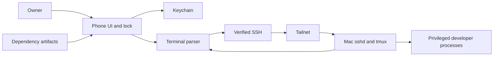

# Security threat model

## Executive summary

An unlocked live terminal can exercise the owner's Mac credentials and broad agent authority. The highest-value controls are reliable host verification, protected per-phone SSH keys, short app reauthentication, a privacy cover, no terminal logging, and preventing ambiguous input replay. Per-command approvals would contradict the intended workflow and are not proposed.

## Scope and assumptions

This threat model began when the repository contained only `README.md`. As of September 12, version 0.0.1 (1) is available to the owner through internal TestFlight; implementation evidence and residual gaps below must be distinguished from the original proposed controls. [Architecture](architecture.md), [lifecycle](research/ios-lifecycle.md), [terminal investigation](research/libghostty.md) and [spike plan](spike-plan.md) anchor proposed components and controls.

User-provided context establishes: personal single-owner app, trusted but privileged development Mac, official Tailscale network, ordinary SSH authentication, no public MoshDeck service, broad local agent authority intentionally accepted, and no terminal analytics/cloud storage. Those explicit instructions supply the service-context validation; no extra approval is required to document them. Actual phone/Mac SSH and tmux access, a 6m56s lock recovery, extended foreground use and Airplane Mode-to-5G recovery have physical evidence. The newly source-built TestFlight artifact has not yet received physical qualification. Firewall/grants and complete lock/recovery behavior remain deployment acceptance gaps; see [device evidence](research/physical-device-connection-debug.md).

Out of scope: redesigning Codex's local permissions, defending against an already fully compromised iOS kernel, securing every repository/dependency executed by the owner, and guaranteeing safety after the Mac account itself is compromised.

## System model

### Primary components

Phone UI/composer, Ghostty parser/renderer, SSH adapter, Keychain/trust store; external Tailscale apps/control plane; Mac OpenSSH, tmux and privileged CLI programs. Build-time components include pinned Swift packages, a source-built local XCFramework, Zig patch stack and Apple signing tooling. None of the proposed app runtime controls is implemented merely by writing these documents.

### Data flows and trust boundaries

- Owner -> UI: raw keys/prompt drafts and host configuration through UIKit. Explicit paste/execute distinction, host identity always visible, lock disables input.
- UI -> Keychain: private signing key; device-only protected storage and local authentication. Public host keys are not secrets but their integrity matters.
- Remote peer -> SSH verifier: unauthenticated host-key claim over SSH. Reject unknown until reviewed; changed identity is blocked before offering credentials.
- Phone -> Mac: keys, terminal bytes and resize over SSH within WireGuard. Tailnet grants authorize network reachability; OpenSSH separately authorizes the local account.
- Mac -> terminal engine: attacker-controllable escape sequences, titles, clipboard requests, links and large output. Parse with maintained engine and explicit clipboard/link policy; bound memory.
- Dependencies -> build -> device: executable code and resources. Exact revisions/checksums, provenance, notices and review are the boundary; a checksum verifies artifact identity, not author trust.

#### Diagram

## Assets and security objectives

| Asset | Why it matters | Objective |
| --- | --- | --- |
| Mac account/developer credentials | Terminal access can publish, deploy, read or modify sensitive work | Confidentiality/integrity |
| Phone SSH private key | Durable credential to the development account | Confidentiality/integrity |
| Host trust binding | Prevents credential use and commands on an impostor/wrong host | Integrity |
| Terminal output/composer | May contain private code, prompts, secrets or personal data | Confidentiality |
| Session and input order | Lost/duplicated prompts and stale input can modify the wrong task | Integrity/availability |
| App/dependency artifact | Parser/transport compromise bypasses UI safeguards | Integrity |

## Attacker model

### Capabilities

A thief may hold an unlocked or locked phone. Another ordinary app may interact with the system clipboard but should not read this app's sandbox/Keychain. A network attacker can disrupt traffic or spoof endpoints outside authenticated protections. A compromised tailnet account/device may gain network access subject to policy. A compromised Mac can emit arbitrary terminal output. A dependency publisher/build compromise can alter executable artifacts.

### Non-capabilities

Tailnet membership alone does not possess the separate phone SSH key. Encrypted network observation does not reveal terminal plaintext. An ordinary app cannot be assumed to bypass iOS isolation. A host-key pin cannot protect commands once the correctly authenticated Mac is itself compromised.

## Entry points and attack surfaces

| Surface | How reached | Boundary | Evidence anchor |
| --- | --- | --- | --- |
| Host profile and key enrollment | User configuration | Owner/application | [architecture](architecture.md) authentication boundary |
| SSH handshake | Remote TCP peer | Untrusted network/account | [SSH choice](research/ssh.md) |
| Terminal parser and clipboard | Remote PTY output | Authenticated but untrusted content | [Ghostty adapter](research/libghostty.md) |
| Composer and reconnect | User paste, network interruption | User intent/delivery | [lifecycle invariants](research/ios-lifecycle.md) |
| Lock/app switcher | Scene transitions | User presence/display | [spike plan](spike-plan.md) |
| Binary/packages | Dependency resolution | Build supply chain | [license review](research/licenses.md) |

## Top abuse paths

1. Unlocked-phone thief opens the terminal, uses an already authenticated connection, and exercises Mac credentials.
2. Network/tailnet attacker presents a replaced host key; a trust-all callback accepts it; commands or credentials go to the wrong endpoint.
3. Compromised host emits OSC clipboard reads/writes or deceptive links; phone secrets leak or malicious text is later pasted elsewhere.
4. Prompt paste partially transmits, connection fails, automatic retry re-executes a command or submits into another foreground program.
5. App-switcher snapshot, persistent transcript, draft backup or debug payload logging exposes sensitive output.
6. Malicious terminal output triggers parser memory corruption or unbounded buffering, compromising or exhausting the app.
7. Poisoned XCFramework/package executes with app permissions and steals the SSH identity or live terminal stream.
8. A compromised tailnet account adds an authorized device; broad grants expose services and a weak Mac SSH policy permits developer-account access.

## Threat model table

Existing controls column reflects the current spike source and scoped tests. A source control is not a claim that all physical acceptance scenarios passed.

| ID | Source / prerequisites | Action / impact | Assets | Existing controls | Gap | Recommended mitigation / detection | Likelihood | Severity | Priority |
| --- | --- | --- | --- | --- | --- | --- | --- | --- | --- |
| TM-001 | Thief, unlocked phone | Uses live SSH, full Mac account authority | Mac identity | Separate device-owner app unlock, unlimited authenticated foreground use, five-minute absence grace, explicit Lock closes transport | Full physical timeout/recovery matrix pending | Keep app unlock independent of network retries, explicit Lock disconnects; generic auth events only | Medium: loss is plausible | High: developer identity | High |
| TM-002 | Network/endpoint attacker | Host substitution or wrong-host execution | Trust, credentials | Full-key pin before authentication; loopback substitution test and phone host match passed | Trust enrollment remains manual | Verify out-of-band fingerprint, pin full key by host/port, block changes; record generic mismatch event | Medium: plausible setup error | High | High |
| TM-003 | Host controls PTY | OSC clipboard access, misleading link/title | Clipboard, secrets | Pinned Ghostty with remote clipboard read/write and URL handling disabled | Broader malicious escape-sequence testing pending | Deny remote clipboard reads; writes off or explicit per-request consent; http/https links only after tap, no auto-open; sanitize title display | Medium: arbitrary remote bytes normal | High for leakage | High |
| TM-004 | Network loss during input | Replayed/late input targets wrong process | Input integrity | Attempt ownership, bounded serialized input, no automatic replay, draft retained | Physical interruption-during-paste acceptance pending | Generation checks, serialized paste/key send, no offline queue/retry, retain draft; counts/errors without payload | Medium: common interruption | High for arbitrary commands | High |
| TM-005 | Phone loss, clipboard consumer, logs | Reads snapshots/drafts/output | Sensitive content | Window privacy cover, device-only Keychain profile/draft/key, sanitized diagnostics | Cold-launch and full snapshot/clipboard acceptance pending | Opaque privacy cover on resign-active, no persistent transcript, device-only Keychain, protected draft excluded from backup, no output analytics/logging | Medium | High | High |
| TM-006 | Malicious/noisy host | Parser bug or output flood | App/key availability | Pinned frontend linked on phone; bounded input/output and scrollback; component throughput test | Hostile-stream fuzzing and device memory/battery profiling pending | Pin maintained engine, cap history/buffers, backpressure, fuzz/regression fixtures, no remote file staging; memory high-water counters | Low exploit / medium DoS | High exploit / medium DoS | High |
| TM-007 | Dependency/build compromise | Malicious code in app | All phone app assets | Source/asset checksum inspected | Pinned source reproduction and Release linkage/notice checks passed; physical qualification and ongoing dependency review pending | Exact dependency lock, review patches, rebuild/provenance/link audit; release checksum verification | Low: privileged publisher access | High | High |
| TM-008 | Compromised tailnet identity/device | Reach Mac services and attempt auth | Mac identity | Official Tailscale and separate OpenSSH key auth worked from phone | Full grants/listener exposure review pending | Narrow device-to-host TCP 22 grant, dedicated key, revoke device + key after loss, inspect LAN/public listeners; host SSH auth logs | Medium conditional on policy | High | High |

## Defaults and residual risk

Store a dedicated Ed25519 key using `kSecAttrAccessibleWhenUnlockedThisDeviceOnly`; require app authentication before retrieving it and wipe app-held references on background/lock as far as APIs permit. Swift/Data/crypto copies prevent a blanket zeroization guarantee. For stronger private-key extraction resistance, later test Secure Enclave P-256 with the library's actual signing path; do not call a software Ed25519 key enclave-backed. [Apple Keychain protection](https://developer.apple.com/documentation/security/ksecattraccessiblewhenunlockedthisdeviceonly), [SecureEnclave](https://developer.apple.com/documentation/cryptokit/secureenclave).

Use local authentication on cold launch or after five minutes inactive/backgrounded, not for each command or transport retry. Authenticated foreground use never expires. Inactive-to-background transitions do not extend the deadline; foreground entry evaluates expiry even if suspension prevented a timer from running. A composer sheet is covered/dismissed when app access locks. Explicit Lock always closes the connection. Hide content before app-switcher capture using an opaque cover; blur alone may leave readable shapes. iOS does not provide a general supported way to prevent every screenshot of an app; no absolute screenshot-prevention claim. No terminal/host details in notifications; none exist in MVP.

Clipboard copy is explicit. Optional auto-clear should clear only the app's own still-unchanged clipboard item; do not erase a later copy from another app. Disable Universal Clipboard transfer for sensitive app-created items where supported. Do not continuously read the clipboard. Composer drafts may contain secrets: protect at rest, exclude from backup, and offer Discard. No plaintext credentials in UserDefaults, files, fixtures or logs.

Do not attempt regex secret redaction inside the live terminal: it is unreliable and can break screen state. Instead avoid recording or transmitting output. Diagnostic export should be opt-in, metadata-only and previewed before sharing. The spike currently provides explicit Copy Diagnostics and a protected local metadata file for development retrieval; a dedicated export preview is not implemented. Agent forwarding is off; commands like `ssh somewhere-else` use credentials already available on the Mac.

A separate restricted Mac user would intentionally lose some continuity/credential access and is optional, not a default fix. A malicious authenticated host or an authorized person with an unlocked live session can still cause harm. That residual authority is the user's intended product, not something per-command mobile approvals should redefine.

## Criticality calibration

Critical means reliable remote compromise of the app/key without user trust, or a build that exfiltrates all sessions. High includes a replaced-host acceptance bug, stolen live session access, or unsafe input replay causing privileged changes. Medium includes recoverable buffer exhaustion or prolonged reconnect failure. Low includes non-sensitive status-label errors or cosmetic truncation. No implementation vulnerability is alleged solely from this prospective model.

## Focus paths for security review

| Path | Why | Threats |
| --- | --- | --- |
| `research/libghostty.md` | Clipboard, payload logging, parser and fork evidence | TM-003, 005, 006, 007 |
| `research/ssh.md` | Host verification, private-key ownership, algorithm/auth gaps | TM-001, 002, 008 |
| `research/ios-lifecycle.md` | Input generations, draft retention, lock/reconnect semantics | TM-001, 004, 005 |
| `spike-plan.md` | Required negative tests and implementation evidence gate | All |

These paths are relative to this document; the component spike now adds the concrete review locations below. These components are not yet a complete secured remote app. Runtime and build risks are separated above. All discovered boundary types are represented; user-provided assumptions are explicit and deployment facts remain open.

## Initial implementation review anchors

- `../Sources/MoshDeckCore/SSHConnection.swift`: pinned-key verification, auth, PTY request replies, buffer bounds, disconnect/error paths (TM-002, 004, 006).
- `../Sources/MoshDeckCore/SessionIntent.swift`: shell quoting, exact tmux target, reconnect cannot silently create (TM-004).
- `../Spike/App/MoshDeckSpikeApp.swift`: synthetic-only frontend, clipboard callback and app-switcher cover; the remote tab uses the same protected terminal configuration (TM-003, 005).
- `../Tests/MoshDeckCoreTests/OpenSSHTests.swift`: temporary-key OpenSSH interoperability and host-substitution test. This fixture does not establish iPhone Keychain/lifecycle controls.

- `../Spike/App/RemoteTerminal.swift`: actual Keychain identity, local-auth gate, input FIFO, reconnect generation and paste-intent guards (TM-001, 002, 004, 005). A physical phone attempt verified key loading, host match, authentication, PTY and shell output; input/reconnect/lock acceptance remains incomplete.
- `../Spike/App/MoshDeckSpikeApp.swift` also supplies a window-level inactive-scene cover (including sheets) and explicitly denies remote clipboard read/write in terminal configuration. The wrapper's confirmation callback alone would not block its default allowed clipboard writes.

## Source audit checkpoint — 2026-09-07

Reviewed the current first-party Keychain, authentication, SSH verification, clipboard/share, logging and diagnostic call sites, plus the pinned wrapper's `TerminalDebugLog` default. This is a bounded source review, not proof against a compromised dependency or a complete device privacy test.

- Identity creation and profile/draft insertion use `kSecAttrAccessibleWhenUnlockedThisDeviceOnly`; no synchronizable attribute or private-key Share/Copy action exists. Identity loading is gated by app unlock in the remote model. The software Ed25519 key remains extractable by code running with the app's authority; no Secure Enclave claim applies.
- SSH host validation compares parsed public keys for equality. There is no trust-all branch. Existing negative OpenSSH and non-retryable host/auth tests cover substitution and rejection.
- Diagnostic call sites use fixed stages/events, numeric errors and a public identity fingerprint. Generic error capture excludes NSError domain, localized description and userInfo. No first-party call site exports terminal bytes or drafts. The protected development diagnostic file contains metadata, not a transcript. Its comment saying “no keys” means no key material; the public fingerprint is intentionally included.
- The pinned wrapper defaults `TerminalDebugLog.isEnabled` to false. The fixture additionally calls `disable`; no app call enables it. The wrapper does contain payload logging code, so preserving the disabled setting remains part of dependency upgrade review.
- Remote OSC clipboard reads/writes are denied by terminal configuration; URL auto-opening is disabled. Native viewport selection Copy uses the normal UIKit clipboard and is **not** currently marked local-only. This is an outstanding clipboard privacy limitation, distinct from remote clipboard access. Public-key sharing is intentional.
- App lock/scene cover and selection/draft concealment exist in source, but complete physical app-switcher, native Copy and VoiceOver acceptance remains pending. Source inspection cannot establish those visual outcomes.

The native dependency audit also found linked LGPL libintl; see [license findings](research/licenses.md). Distribution/provenance review remains open. No credential leakage or host-verification bypass was found in the inspected first-party paths; this statement is limited to those paths and tests.
